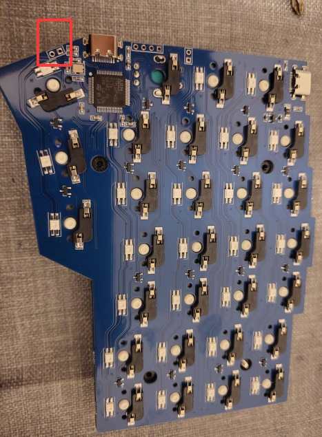

# BORNE m57 / Knauf Corne 4x6 - QMK/Vial firmware patches

custom firmware patches for the **BORNE m57** split keyboard (sold as "Knauf Corne 4x6" by Ymdkey, 58 keys, STM32F401, south-facing RGB). vendor source had broken led mapping and no software bootloader entry. this repo fixes both.

## hardware

- **MCU**: STM32F401RCT6 per side (256K flash, 64K SRAM)
- **bootloader**: LG Studio Plum UF2 Bootloader 0.0.1 (vid `239a:005d`, board id `Plum Bootloader for STM32F401`, family id `0xabcdf401`) - upstream: [HaiMianBBao/PlumBL](https://github.com/HaiMianBBao/PlumBL)
- **firmware**: vial-qmk based, 58 ws2812 LEDs (29 per side), 2 EC11 encoders
- **split**: master-right via `MASTER_RIGHT`, hardware hand detect on `C1`, full-duplex usart1 at 19200 baud

## what's patched

versus the vendor source ([source/borne_source_vendor.zip](source/borne_source_vendor.zip)):

1. **led matrix mapping (`source/m57/m57.c` `g_led_config`)** - vendor mapping was alternating L/R/L/R rows in the matrix→led table, causing wrong-half LEDs to light on `solid_reactive` and similar effects. rewrote to match the actual hardware chain order, per-key verified on both halves
2. **bootloader_jump** - vendor set `BOOTLOADER=custom` in `info.json` but never provided an implementation. `QK_BOOT` keycode and vial's "reboot to bootloader" were both no-ops. added implementation that writes the PlumBL magic `0xc220b134` to RAM `0x2000fc00` then calls `NVIC_SystemReset()` - now `QK_BOOT` jumps to DFU mode without tweezers
3. **flash automation** - `scripts/flash.sh` watches for `Adafruit PlumBootloader` to appear, mounts the mass-storage drive, copies the uf2, syncs, and waits for firmware reboot. one command = full flash cycle

## first-time bootloader entry (tweezer method)

before you can flash anything, you need to get into bootloader mode at least once. there are two exposed reset pads on the back of each half's PCB - top-left corner near the USB-C port and MCU (red box):



1. unscrew the case, remove keycaps and switches around the top-left to expose the back of the PCB on the half you want to flash
2. plug usb into that half only (disconnect inter-half cable for safety)
3. with tweezers (or a paperclip bent flat), bridge both pads briefly, lift, then bridge again **within ~500ms** - mouse double-click rhythm
4. the keyboard should re-enumerate as `Adafruit PlumBootloader` and a 32MB FAT volume labeled `STM32F4Plum` appears

right half has the same pad layout (mirror position).

once you flash a build with `bootloader_jump` working (any post-`6ab532f` build in this repo), **you never need the tweezers again** - just bind `QK_BOOT` to a key in vial and press it.

## flashing

assuming you're in this repo's working directory and the keyboard is in bootloader mode:

```bash
./scripts/flash.sh                                                    # uses firmware/borne_m57_via_fixed_ledconfig.uf2
./scripts/flash.sh path/to/your.uf2                                    # or a custom uf2
```

the script polls `lsusb` for the bootloader, finds the right `/dev/sd?`, mounts, copies, syncs, unmounts, and waits for the firmware reboot. it'll take about 5 seconds end-to-end. **flash both halves separately** - usb cable to one half, flash, then usb to the other half, flash again.

manual fallback if the script chokes:

```bash
sudo mount /dev/sda /mnt                                               # or sdb depending on enumeration
sudo cp firmware/borne_m57_via_fixed_ledconfig.uf2 /mnt/
sync
sudo umount /mnt
```

## building from source

### docker (recommended)

self-contained build, no qmk/toolchain on host. needs only docker (with BuildKit, default since Docker 23.0):

```bash
./scripts/build.sh
# -> build/m57_via.uf2
```

first run takes ~5-10 min (apt + vial-qmk clone + submodule init + compile). subsequent runs cache everything except the final compile, ~30s. the [Dockerfile](Dockerfile) is multi-stage with a `scratch` export stage so `--output type=local` extracts just the .uf2 to `build/`.

### manual (if you already have a qmk/vial-qmk tree)

the keyboard source ([source/m57/](source/m57/)) is a drop-in for vial-qmk, not a standalone project:

```bash
# clone vial-qmk (~1.4GB with submodules)
git clone --depth 1 https://github.com/vial-kb/vial-qmk ~/projects/vial-qmk
cd ~/projects/vial-qmk
git submodule update --init --recursive --depth 1

# symlink the keyboard def into the qmk tree
ln -s /path/to/this/repo/source/m57 ~/projects/vial-qmk/keyboards/m57

# place the linker scripts where qmk's build system expects
cp /path/to/this/repo/source/ld/QF_STM32F401.ld \
   /path/to/this/repo/source/ld/PlumBL_STM32F401.ld \
   ~/projects/vial-qmk/platforms/chibios/boards/common/ld/

# build (nixos: get qmk + arm-none-eabi-gcc via nix-shell)
nix-shell -p qmk --run "cd ~/projects/vial-qmk && make m57:via"

# output:
ls ~/projects/vial-qmk/.build/m57_via.uf2
```

non-nixos: install `qmk` cli + `gcc-arm-embedded` via your package manager.

## vial keymap

both vial and via are enabled with `VIAL_INSECURE` (no unlock combo needed). 10 dynamic layers, 15 macros, 4kb logical eeprom on wear-leveling.

vial keymap UID: `0x89, 0x36, 0x2A, 0xC7, 0xFA, 0xD8, 0x89, 0x45` (set in `source/m57/keymaps/via/config.h`). keymap edits made in vial persist across firmware flashes as long as this UID and the eeprom layout don't change.

vial layout backups: [vil_backups/](vil_backups/).

led pattern visualization (layers 0-6 + home-row mod-tap explainer): [docs/led_layers.html](docs/led_layers.html) - [rendered via htmlpreview](https://htmlpreview.github.io/?https://github.com/sophronesis/borne-m57-firmware/blob/led_layering/docs/led_layers.html).

## repo layout

```
source/m57/             keyboard definition (drop into vial-qmk/keyboards/)
source/ld/              linker scripts (QF_STM32F401.ld, PlumBL_STM32F401.ld, STM32L433xC.ld)
source/borne_source_vendor.zip   original vendor source for reference
firmware/               prebuilt uf2 firmware images
  *_vendor.uf2          original vendor build (broken QK_BOOT)
  *_10layers.uf2        vendor variant with 10 layer count
  *_fixed_ledconfig.uf2 patched build (this repo's output)
vil_backups/            user-saved vial layout snapshots
scripts/flash.sh        bootloader-watching auto-flash helper
CLAUDE.md               project docs aimed at Claude Code agents
todo.md                 work-in-progress notes during the patch sessions
```

## known rough edges

- `source/m57/info.json` has a missing comma + trailing commas around the `[9, 2]` / `[9, 3]` block. qmk still parses it but `qmk lint` complains. fix only when it actually blocks a build
- right half led mapping is verified for matrix col → user col alignment, but a few inner-extra LED positions are physically asymmetric vs left half (the PCB chain isn't a perfect mirror). see commit `8c3e666` for details
- if you change the eeprom layout (e.g., bump `DYNAMIC_KEYMAP_LAYER_COUNT`), the wear-leveling backing region needs to grow too (`WEAR_LEVELING_BACKING_SIZE` in `config.h`). don't raise `DYNAMIC_KEYMAP_EEPROM_MAX_ADDR` past 4095 without adjusting this

## sources / credits

- vendor (BORNE m57 keyboard + reset hole tip): Ymdkey via Discord
- Plum bootloader: [HaiMianBBao/PlumBL](https://github.com/HaiMianBBao/PlumBL) (LG Studio fork shipped on the BORNE)
- vial-qmk: [vial-kb/vial-qmk](https://github.com/vial-kb/vial-qmk)
- patches done iteratively with help of Claude Code
